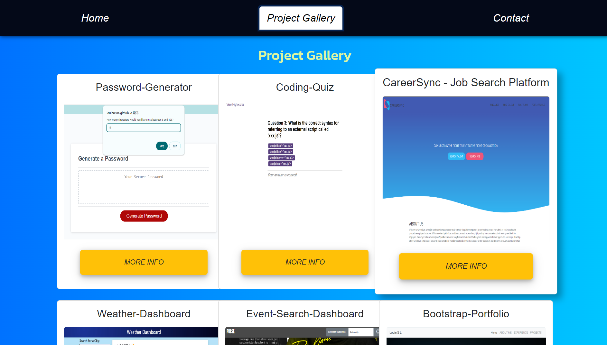

# My React-Portfolio

## Description

This is my portfolio project which built with React. It contains basic information about me and my projects.

## Table of contents

- [My React-Portfolio](#my-react-portfolio)
  - [Description](#description)
  - [Table of contents](#table-of-contents)
  - [User story](#user-story)
  - [Usage](#usage)
  - [Installation](#installation)
  - [Screenshots](#screenshots)
  - [Technologies Used](#technologies-used)
  - [License](#license)
  - [Questions](#questions)

## User story

- As a front-end developer I wants to create a webpage that displays my name, role, and contact information.
- that shows my projects.
- so that a user have quick access to my profiles and projects.

## Usage

To goto the website.

## Installation

1. No need to install, just click on the link.

## Screenshots

## Technologies Used

HTML, CSS, JavaScript, Bootstrap, React

<pre> <code> https://louie888a.github.io/React-Portfolio/ </code> </pre>

## License

This project is licensed under the terms of the MIT license.

## Questions

If you have any questions about the repo, open an issue or contact me directly at here [here](mailto:9394hohoho@gmail.com). You can find more of my work at [github/Louie888A](https://github.com/Louie888A).
